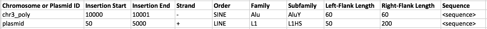

# Software for Quantifying Interspersed Repeat Expression #

**SQuIRE** is a tool for finding and analyzing unique repeat regions within a family of repeats.

[Installation](#installation)

[SQuIRE Pipeline Overview](#pipeline)

[SQuIRE Pipeline Options](#arguments-for-each-step)

[FAQs](#faqs)

[Example Pipeline](#example-pipeline)

## Installation ##

##### Virtual Environments ####

SQuIRE works best in a virtual environment.  We recommend using Conda to set up the SQuIRE environment.

Conda is a simple tool that both installs and stores variables and modules in Python environments for repeated use.  

First, check if miniconda is already installed
   * `conda`

1. Download Miniconda from https://conda.io/miniconda.html

    * `wget -c https://repo.continuum.io/miniconda/Miniconda2-latest-Linux-x86_64.sh`
    * Documentation will appear as the software downloads

2. Execute the installer and add to PATH in .bashrc
    * `bash Miniconda2-latest-Linux-x86_64.sh`
    * Press ENTER key to review the Miniconda license
    * Type `yes` to approve the license terms
    * Pres ENTER key to confirm install locatino (or enter a preferred location)
    * Type `yes` to add Miniconda2 into your PATH

3. Add PATH to .bash_profile as well
    *  `tail -n1 ~/.bashrc >> ~/.bash_profile`

4. Restart shell
    * `exec $SHELL`

5. Create new virtual environment
    * `conda create --name squire --override-channels -c iuc -c bioconda -c conda-forge -c defaults -c r python=2.7.9 bioconductor-deseq2=1.16.1 r-base=3.4.1 r-pheatmap bioconductor-vsn bioconductor-biocparallel=1.12.0 r-ggrepel  star=2.5.3a  bedtools=2.25.0 samtools=1.8 stringtie=1.3.3 igvtools=2.3.93  ucsc-genepredtobed    ucsc-genepredtogtf  ucsc-bedgraphtobigwig r-hexbin `

    * Type `y` to proceed.

5. Install SQuIRE in the virtual environment
    * `pip install --index-url https://test.pypi.org/simple/ --extra-index-url https://pypi.org/simple SQuIRE`

6. **Activate the virtual environment each time you the SQuIRE pipeline**

    * `source activate squire`

SQuIRE was written and tested with the following specific versions of software:
* `STAR 2.5.3a`
* `bedtools 2.25.0`
* `samtools 1.8`
* `stringtie 1.3.3b`
* `DESeq2 1.16.1`
* `R 3.4.1`
* `Python 2.7.9`

_*If installing these software with conda is unsuccessful, we recommend installing these versions with squire Build to ensure compatibility with SQuIRE.*_
  * [squire Build:](#squire-build)
      * `squire Build -s all`

#### Pipeline Steps ####

Preparation Stage
1)    [Fetch:](#squire-fetch)
                        Downloads input files from RefGene and generates STAR index
                        Only needs to be done once initially to acquire genomic input files or if a new build is desired.

2)    [Clean:](#squire-clean)
                        Filters Repeatmasker file for Repeats of interest, collapses overlapping repeats, and returns as BED file.

Quantification Stage

1)    [Map:](#squire-map)
                        Aligns RNAseq data

2)    [Count:](#squire-count)
                        Quantifies RNAseq reads aligning to TEs

Analysis Stage

1)    [Call:](#squire-call)
                        Compiles and outputs differential expression from multiple alignments

Follow-up Stage
1)    [Draw:](#squire-draw)
                        Creates BEDgraphs from RNAseq data

2)    [Seek:](#squire-seek)
                        Reports individual transposable element sequences

## Arguments for each step ##

#### squire Build ####
*_Use Build only if conda create does not successfully install software._*

- Download and install required software (STAR, Bedtools, Samtools, and/or Stringtie)
- Adds software to PATH

- **usage** squire Build -o -s STAR,bedtools,samtools,stringtie -v

| Arguments: |    |
| --- | --- |
|  -b, --folder | Destination folder for downloaded UCSC file(s). Optional; default='squire_build' |
|  -s <software list or 'all'>, --software | Install required SQuIRE software and add to PATH - specify 'all' or provide comma-separated list (no spaces) of: STAR,bedtools,samtools,stringtie. Optional; default = False |
|  -v, --verbosity | Want messages and runtime printed to stderr. Optional. |

### Preparation Stage ###

#### squire Fetch ####

  - Downloads required files from repeatmasker

  - Only needs to be used the first time SQuIRE is used to transfer required genomic build references to your machine
  - Outputs annotation files, chromosome fasta file(s) and STAR index

  - **usage:** `squire Fetch [-h] -b <build> [-o <folder>] [-f] [-c] [-r] [-g] [-x] [-p <int>] [-k] [-v]`

| Arguments |   |
| --- | --- |
 -h, --help | show this help message and exit
 -b <build>, --build <build> | UCSC designation for genome build, eg. 'hg38'
 -o <folder>, --fetch_folder | Destination folder for downloaded UCSC file(s), default folder is 'squire_fetch'
 -f, --fasta | Download chromosome fasta files for build chromosomes. Optional
 -c, --chrom_info | Download chrom_info.txt file with chromosome lengths. Optional
 -r, --rmsk | Download Repeatmasker file. Optional
 -g, --gene | Download UCSC gene annotation. Optional
 -x, --index | Create STAR index (WARNING: will take a lot of time and memory!), optional
 -p, --pthreads | Launch <int> parallel threads. Optional, default = 1
 -k, --keep | Keep downloaded compressed files. Optional, default = False
 -v, --verbosity | Print messages and runtime records to stderr. Optional; default = False

#### squire Clean ####

   - Filters genomic coordinates of Repeats of interest from repeatmasker, collapses overlapping TEs, and returns BED file and count of subfamily copies.

   - Only needs to be done at the first use of SQuIRE pipeline to clean up the index files
   - Outputs .bed file of TE coordinates, strand and divergence

   - **usage:** `squire Clean [-h] [-r <rmsk.txt or file.out>] [-b <build>] [-o <folder>] [-c <classes>] [-f <subfamilies>] [-s <families>] [-e <file>] [-v]`

| Arguments |   |
| --- | --- |
  -h, --help | show this help message and exit
  -r, --rmsk | Repeatmasker file, default will search 'squire_fetch' folder for rmsk.txt or .out file. Optional
  -b, --build | UCSC designation for genome build, eg. 'hg37'
  -o, --clean_folder | Destination folder for output BED file, default folder is 'squire_clean'
  -c, --repclass | Comma-separated list of desired repeat classes (AKA superfamilies), eg 'DNA,LTR'. Column 12 in repeatmasker file. Can use UNIX wildcard patterns. Optional
  -f, --family | Comma-separated list of desired repeat families, eg 'ERV1,ERVK,ERVL'.  Column 13 on repeatmasker file.  Can use UNIX wildcard patterns. Optional
  -s, --subfamilies | Comma-separated list of desired repeat subfamilies, eg 'L1HS,AluYb'. Column 11 in repeatmasker file. Can use UNIX wildcard patterns. Optional
  -e, --extra | Filepath of extra tab-delimited file containing non-reference repeat sequences. Columns should be chr, start, stop, strand, subfamily, and sequence.  Optional; default = False
  -v, --verbosity | Print messages and runtime records to stderr. Optional; default = False

### Quantification Stage ###

#### squire Map ####

   - Aligns RNAseq reads to STAR index allowing for multiple alignments
   - Outputs .bam file

   - **usage:** `squire Map [-h] [-1 <file_1.fastq or file_1.fastq.gz>] [-2 <file_2.fastq or file_2.fastq.gz>] [-o <folder>] -r <int> [-x <index>] [-n <str>] [-3 <int>] [-e <file.txt>] [-g <gtf>] [-p <int>] [-v]`

| Arguments |    |
| --- | --- |
  -h, --help | show this help message and exit
  -1, --read1 | RNASeq data .fastq file; read1 if providing paired end data. Can be gzipped. Required for single-end data, optional for paired-end
  -2, --read2 | RNASeq data read2 .fastq file Can be gzipped. Optional unless no read1 provided
  -o, --map_folder <folder> | Destination folder for output files. Optional, default = 'squire_map'
  -r, --read_length | Read length (if trim3 selected, after trimming; required)
  -x, --index | Genome STAR index folder. Optional; will search for squire_fetch by default
  -n, --name | Common basename for input files. Optional, default = read1
  -3, --trim3 | Trim <int> bases from right end of each read before alignment. Optional; default = 0
  -e, --extra | Filepath of text file containing non-reference repeat sequence and genome information. Optional, default = False
  -g, --gtf | Optional GTF of genome transcripts.  For those interested in gene transcription
  -m, --mask | Separate reads from bamfile that map to plasmid or transgene into another file. Optional; default = False
  -p, --pthreads | Launch <int> parallel threads. Optional, default = '1'
  -v, --verbosity | Print messages and runtime records to stderr. Optional; default = False

##### Extra File Format #####
If target analysis is regarding plasmids and polymorphisms that are not included in the reference sequence, SQuIRE Map can accept additional sequence files at this step.  These extra sequences must be formatted in a tab delimited text files.

The following information is included in the file:
  1. **Chromosome or Plasmid Identification**
    * *Chromosome:* must include "\_x" after the chrX input to differentiate the extra sequence from the entire chromosome reference.  If underscore is not included the polymorphism will replace the entire chromosome.  See formatting specifics in below example file.
    * *Plasmid:* unique plasmid name
  2. **Insertion Start**
    * 0-based numerical start location of the non-reference repeat
  3. **Insertion End**
    * 0-based numerical end location.  For chromosome insertions, will only be one base different from Insertion Start
  4. **Strand**
    * \+ or - depending on strandedness
  5. **Order**
    * TE order (e.g. SINE)
  6. **Family**
    * TE family (e.g. Alu)
  7. **Subfamily**
    * Te subfamily (e.g. AluY)
  8. **Left-Flank Length**
    * Number of bases in the left flanking region before the sequence
  9. **Right-Flank Length**
    * Number of bases in the right flanking region after the sequence
  10. **Sequence**
    * List of bases in the non-reference repeat

##### Example File #####

#### squire Count ####

  - Quantifies RNAseq reads aligning to TEs.
  - Outputs TE count file and subfamily count file

  - **usage:** `squire Count [-h] [-m <folder>] [-c <folder>] [-o <folder>] [-t <folder>] [-n <str>] [-b <build>] [-s <file>] [-e EM] [-v]`

| Arguments: |    |
| --- | --- |
  -h, --help | show this help message and exit
  -m, --map_folder <folder> | Folder location of outputs from SQuIRE Map. Optional, default = 'squire_map'
  -c, --clean_folder | Folder location of outputs from SQuIRE Clean. Optional, default = 'squire_clean'
  -o, --count_folder | Destination folder for output files.  Optional, default = 'squire_count'
  -t, --tempfolder | Folder for tempfiles.  Optional, default = 'outfolder'
  -n, --name | Common basename for input files. Required if more than one bam file in map_folder
  -b, --build | UCSC designation for genome build, eg 'hg38'. Required if more than one bam file in map_folder
  -s, --strandedness | '0' if unstranded, '1' if first-strand (eg Illumina Truseq, dUTP, NSR, NNSR), '2' if second-strand (eg Ligation, Standard).  Optional, default = 0
  -e EM, --EM EM | Run estimation-maximization on TE counts given number of times. Optional, default = False
  -v, --verbosity | Print messages and runtime records to stderr. Optional; default = False

### Analysis Stage ###

#### squire Call ####

  - Compiles and outputs differential expression from multiple alignments
  - Outputs count table, column data, DESeq2 results table, and graphs

  - **usage** squire Call

  | Arguments |   |
  | --- | --- |
  -1,--group1 | List of basenames for group1 (Treatment) samples, can also provide string pattern common to all group1 basenames
  -2,--group2 | List of basenames for group2 (Control) samples, can also provide string pattern common to all group2 basenames
  -A,--condition1 | Name of condition for group1
  -B,--condition2 | Name of condition for group2
  -i,--count_folder | Folder location of outputs from SQuIRE Count (optional, default = 'squire_count')
  -o,--call_folder | Destination folder for output files (optional; default='squire_call')
  -s,--subfamily | Compare TE counts by subfamily. Otherwise, compares TEs at locus level (optional; default=False)
  -p,--pthreads | Launch <int> parallel threads(optional; default='1')
  -N,--projectname | Basename for project
  -f,--output_format | Output figures as html or pdf
  -v,--verbosity | Want messages and runtime printed to stderr (optional; default=False)

### Follow-up Stage ###

#### squire Draw ####

  - Creates bedgraphs from RNAseq data
  
  - **usage** squire Draw [-h] [-m <folder] [-o <folder>] [-n <str>] [-s <int>] [-v]

| Arguments |   |
| --- | --- |
  -h, --help | show this help message and exit
  -f, --fetch_folder | Folder location of outputs from SQuIRE Fetch. Optional, default = 'squire_fetch'
  -m <folder>, --map_folder <folder> | Folder location of outputs from SQuIRE Map. Optional, default = 'squire_map'
  -o <folder>, --draw_folder <folder> | Destination folder for output files. Optional, default = 'squire_draw'
  -n <str>, --name <str> | Basename for bam file (required if more than one bam file in map_folder)
  -s <int>, --strandedness <int> | '0' if unstranded, '1' if first-strand (eg Illumina Truseq, dUTP, NSR, NNSR), '2' if second-strand (eg Ligation, Standard).  Optional, default = 0
  -b, --build | UCSC designation for genome build, eg. 'hg38'
  -l, --normlib | Normalize bedgraphs by library size. Optional, default = False
  -p, --pthreads | Launch <int> parallel threads. Optional, default = 1
  -v, --verbosity | Print messages and runtime records to stderr (optional; default=False)

#### squire Seek ####

  - Retrieves transposable element sequences from chromosome fasta files
  - Outputs sequences in FASTA format

  - **usage** squire Seek

| Arguments |   |
| --- | --- |
| -h, --help | show this help message and exit |
| -i, --infile | Repeat genomic coordinates, can be TE_ID, bedfile, or gff |
| -o, --outfile | Repeat sequences output file (FASTA), can use "-" for stdout |
| -g, --genome | Genome build's fasta chromosomes - .fa file or .chromFa folder |
| -v, --verbosity | Print messages and runtime records to stderr. Optional; default = False |

### Argument Organization ###
SQuIRE can save an entire project's arguments in one input script that stores.  The variables can be saved to keep track of the parameters used in each project.

## FAQs ##

#### How do I know if my data is stranded or not? ####
The [RNA-seqlopedia](https://rnaseq.uoregon.edu/) by Cresko Lab at University of Oregon outlines strand specific data in section 3.7 Preparation of stranded libraries.  You can verify the strand specificity with the researcher who collected the data, or use an outside program like infer-experiment.py in [RSeQC](http://rseqc.sourceforge.net/) or the libtype option in [Salmon](http://salmon.readthedocs.io/en/latest/salmon.html).

#### How much memory does each step require? ####
You can gauge how much vmem to assign to each job based on the number of reads in your datasets.

#### Can SQuIRE be used on ChIP or small RNA? ####
Not right now, but to be addressed in the future.

### Example Pipeline ###
INSTRUCTIONS
1. Copy the sample_scripts folder to your project folder
    * `mkdir <project folder>/scripts`
    * `cp SQuIRE/sample_scripts/* <project folder>/scripts`
    * `cd <project folder>/scripts`
2. Fill out the arguments.sh file
3. Replace "squire@email.com" in the `#$ -M squire@email.com` line with your email address to get alert of script completion and memory usage
4. Submit jobs to SGE cluster (the -cwd option results in error and output files associated to stay in your current working directory)

    * `qsub -cwd fetch.sh arguments.sh`
    * `qsub -cwd clean.sh arguments.sh`
    * `qsub -cwd loop_map.sh arguments.sh`
    * `qsub -cwd loop_count.sh arguments.sh`
    * `qsub -cwd call.sh arguments.sh`
    * `qsub -cwd loop_draw.sh arguments.sh`

5. If a memory or segmentation fault error occurs, edit the `#$ -l mem_free` and `#$ -l h_vmem` lines to increase memory usage for the appropriate script.
