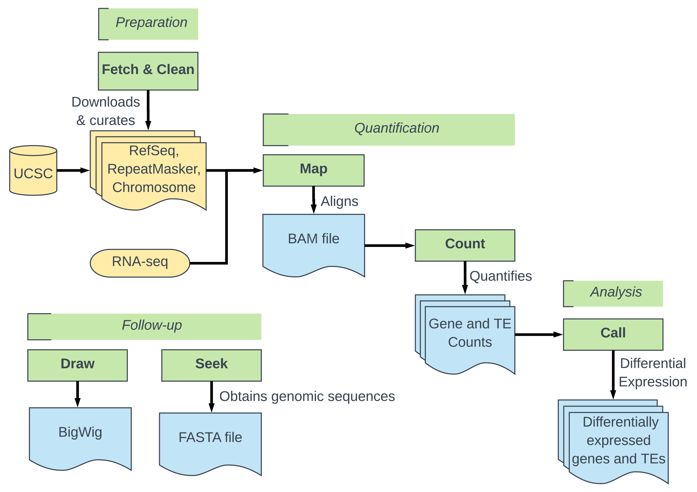
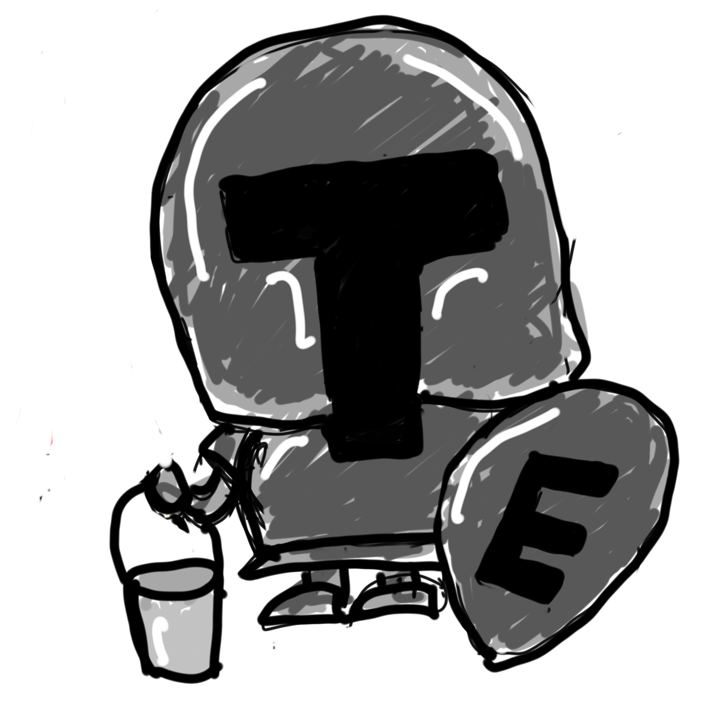
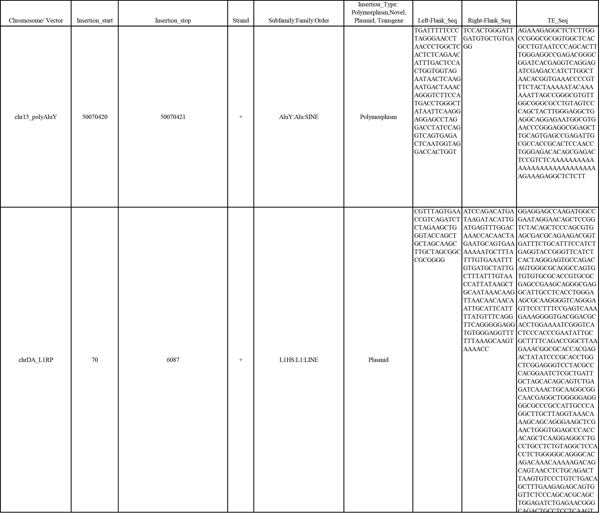
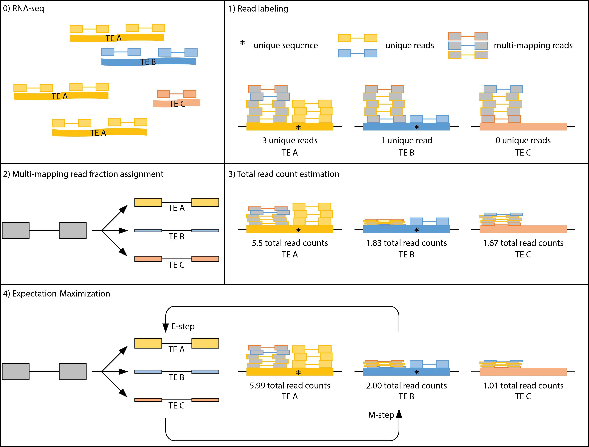
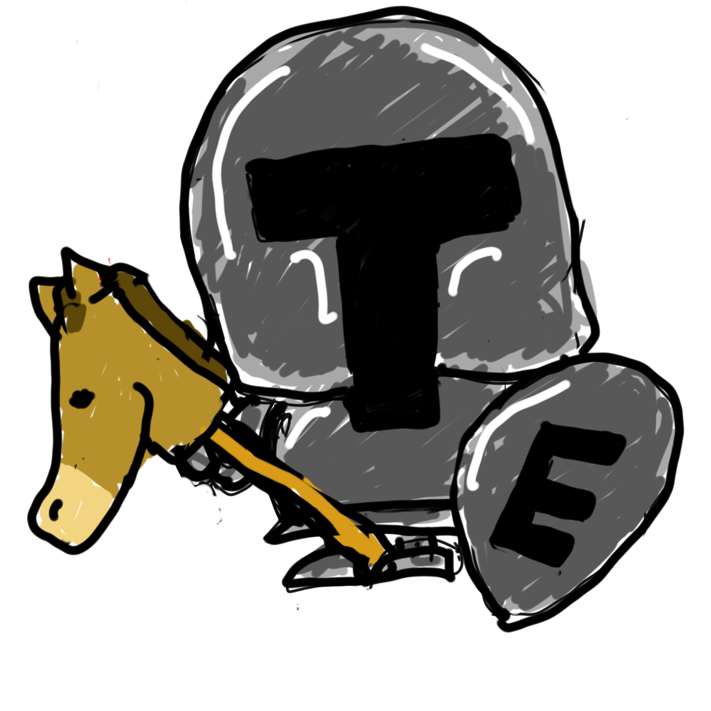

# Software for Quantifying Interspersed Repeat Expression #

**SQuIRE** is a tool for finding and analyzing unique repeat regions within a family of repeats.

[Installation](#installation)

[SQuIRE Pipeline Overview](#pipeline)

[SQuIRE Pipeline Options](#arguments-for-each-step)

[FAQs](#faqs)

[Example Pipeline](#example-pipeline)

## Installation ##

We recommend using [Conda](https://conda.io/docs/) for SQuIRE installation.

Conda is a package manager that installs and runs packages and their dependencies.  Conda also creates virtual environments and allows users to switch between those environments. The instructions below installs Conda and creates a virtual environment in which to install software required by SQuIRE. Following these instructions ensures that SQuIRE has the correct software versions and dependencies and prevents software conflicts.

1. Download Miniconda from https://conda.io/miniconda.html

    * `wget -c https://repo.continuum.io/miniconda/Miniconda3-latest-Linux-x86_64.sh`
    * Documentation will appear as the software downloads

2. Execute the installer and add to PATH in .bashrc
    * `bash Miniconda3-latest-Linux-x86_64.sh`
    * Press ENTER key to review the Miniconda license
    * Type `yes` to approve the license terms
    * Pres ENTER key to confirm install locatino (or enter a preferred location)
    * Type `yes` to add Miniconda2 into your PATH

3. Add PATH to .bash_profile as well
    *  `tail -n1 ~/.bashrc >> ~/.bash_profile`

4. Restart shell
    * `exec $SHELL`

5. Create new virtual environment
    * `conda create --name squire --override-channels -c iuc -c bioconda -c conda-forge -c defaults -c r python=2.7.13 bioconductor-deseq2=1.16.1 r-base=3.4.1 r-pheatmap bioconductor-vsn bioconductor-biocparallel=1.12.0 r-ggrepel  star=2.5.3a  bedtools=2.25.0 samtools=1.1 stringtie=1.3.3 igvtools=2.3.93  ucsc-genepredtobed    ucsc-genepredtogtf  ucsc-bedgraphtobigwig r-hexbin git=2.11.1`

    * Type `y` to proceed.
6. Activate the virtual environment

    * `source activate squire`  
    * **Enter this command each time you wish to use the SQuIRE pipeline**
    * The conda installation message may instruct the use of 'conda activate squire'. However, this is a newer and less stable usage than "source activate squire", which we recommend.

7. Install SQuIRE in the virtual environment
    * `git clone https://github.com/wyang17/SQuIRE; cd SQuIRE; pip install -e .`
    * The `-e` parameter for "pip install" automatially affects the current SQuIRE installation, so that there is no need to re-install SQuIRE with a new version.
    * To update SQuIRE, go to the SQuIRE folder and enter:
      *  `git pull`

### Notes ###

_*SQuIRE was written and tested with the following specific versions of software:_*
* `STAR 2.5.3a`
* `bedtools 2.27.0`
* `samtools 1.1`
* `stringtie 1.3.3b`
* `DESeq2 1.16.1`
* `R 3.4.1`
* `Python 2.7`

_*If installing these software with conda is unsuccessful, we recommend installing these versions with squire Build to ensure compatibility with SQuIRE.*_
  * [squire Build:](#squire-build)
      * `squire Build -s all`

## Pipeline Overview ##

*Preparation Stage*
1)    [Fetch:](#squire-fetch)
                        Downloads input files from RefGene and generates STAR index
                        Only needs to be done once initially to acquire genomic input files or if a new build is desired.

2)    [Clean:](#squire-clean)
                        Filters Repeatmasker file for Repeats of interest, collapses overlapping repeats, and returns as BED file.

_*[Optional: Incorporation of non-reference TE sequence](#non-reference-file-format) *_

*Quantification Stage*

1)    [Map:](#squire-map)
                        Aligns RNAseq data

2)    [Count:](#squire-count)
                        Quantifies RNAseq reads aligning to TEs

*Analysis Stage*

1)    [Call:](#squire-call)
                        Compiles and outputs differential expression from multiple alignments

*Follow-up Stage*
1)    [Draw:](#squire-draw)
                        Creates BEDgraphs from RNAseq data

2)    [Seek:](#squire-seek)
                        Reports individual transposable element sequences

An example pipeline with sample scripts is described [here](#example-pipeline).

## Arguments for each step ##

#### squire Build ####
*_Use Build only if conda create does not successfully install software._*

- Download and install required software (STAR, Bedtools, Samtools, and/or Stringtie)
- Adds software to PATH

- **usage** squire Build -o -s STAR,bedtools,samtools,stringtie -v

| Arguments: |    |
| --- | --- |
|  -b, --folder | Destination folder for downloaded UCSC file(s). Optional; default='squire_build' |
|  -s <software>, --software <software> | Install required SQuIRE software and add to PATH - specify 'all' or provide comma-separated list (no spaces) of: STAR,bedtools,samtools,stringtie. Optional; default = False |
|  -v, --verbosity | Want messages and runtime printed to stderr. Optional. |

### Preparation Stage ###

#### squire Fetch ####

  - Downloads required files from repeatmasker

  - Only needs to be used the first time SQuIRE is used to transfer required genomic build references to your machine
  - Outputs annotation files, chromosome fasta file(s) and STAR index

  - **usage:** `squire Fetch [-h] -b <build> [-o <folder>] [-f] [-c] [-r] [-g] [-x] [-p <int>] [-k] [-v]`

| Arguments |   |
| --- | --- |
 -h, --help | show this help message and exit
 -b <build>, --build <build> | UCSC designation for genome build, eg. 'hg38'
 -o <folder>, --fetch_folder <folder>| Destination folder for downloaded UCSC file(s), default folder is 'squire_fetch'
 -f, --fasta | Download chromosome fasta files for build chromosomes. Optional
 -c, --chrom_info | Download chrom_info.txt file with chromosome lengths. Optional
 -r, --rmsk | Download Repeatmasker file. Optional
 -g, --gene | Download UCSC gene annotation. Optional
 -x, --index | Create STAR index (WARNING: will take a lot of time and memory!), optional
 -p <int>, --pthreads <int>| Launch <int> parallel threads. Optional, default = 1
 -k, --keep | Keep downloaded compressed files. Optional, default = False
 -v, --verbosity | Print messages and runtime records to stderr. Optional; default = False

#### squire Clean ####

   - Filters genomic coordinates of Repeats of interest from repeatmasker, collapses overlapping TEs, and returns BED file and count of subfamily copies.

   - Only needs to be done at the first use of SQuIRE pipeline to clean up the index files
   - Outputs .bed file of TE coordinates, strand and divergence

   - **usage:** `squire Clean [-h] [-r <rmsk.txt or file.out>] [-b <build>] [-o <folder>] [-c <classes>] [-f <subfamilies>] [-s <families>] [-e <file>] [-v]`

| Arguments |   |
| --- | --- |
  -h, --help | show this help message and exit
  -r <file>, --rmsk <file> | Repeatmasker file, default will search 'squire_fetch' folder for rmsk.txt or .out file. Optional
  -b <str>, --build <str> | UCSC designation for genome build, eg. 'hg37'
  -o <folder>, --clean_folder <folder>| Destination folder for output BED file, default folder is 'squire_clean'
  -c <str>, --repclass <str> | Comma-separated list of desired repeat classes (AKA superfamilies), eg 'DNA,LTR'. Column 12 in repeatmasker file. Can use UNIX wildcard patterns.  Optional
  -f <str>, --family <str> | Comma-separated list of desired repeat families, eg 'ERV1,ERVK,ERVL'.  Column 13 on repeatmasker file.  Can use UNIX wildcard patterns. Optional
  -s <str>, --subfamily <str>| Comma-separated list of desired repeat subfamilies, eg 'L1HS,AluYb'. Column 11 in repeatmasker file. Can use UNIX wildcard patterns. Optional
  -e <file>, --extra <file>| Filepath of extra tab-delimited file containing non-reference repeat sequences. Columns should be chr, start, stop, strand, subfamily, and sequence.  Optional; default = False
  -v, --verbosity | Print messages and runtime records to stderr. Optional; default = False

#### Non-reference File Format ####
For known TE sequences that are not included in the reference genome, a tab-delimited file can be provided to SQuIRE to incorporate the non-reference TEs into the analysis. This file can be inputted into the Map and Clean steps with the `--extra` parameter.

The following information should be included in the file:
  1. **Chromosome or Plasmid Identification** 
    * SQuIRE will add an identifier with an underscore "\_" and the insertion type to distinguish the annotation from the reference genome.
  2. **Insertion Start**
    * 0-based numerical start location of the non-reference repeat.
  3. **Insertion End**
    * 0-based numerical end location.  For chromosome insertions, this will only be one base different from Insertion Start.
  4. **Strand**
    * \+ or - Orientation of 'sense' strand of TE annotation.
  5. **TE classification**
    * Provide TE Subfamily, Family and Order, separated by colons ":".
  6. **Insertion Type**
    * Must be one of: polymorphic insertion, novel insertion, plasmid, or transgene.
  7. **Left-Flank Sequence**
    * Flanking sequence before the TE insertion.
  8. **Right-Flank Sequence**
    * Flanking sequence after the TE insertion.
  9. **TE Sequence**
    * Non-reference TE sequence.

##### Example File #####

### Quantification Stage ###

#### squire Map ####

   - Aligns RNAseq reads to STAR index allowing for multiple alignments
   - Outputs .bam file

   - **usage:** `squire Map [-h] [-1 <file_1.fastq or file_1.fastq.gz>] [-2 <file_2.fastq or file_2.fastq.gz>] [-o <folder>][-f <folder>] -r <int> [-n <str>] [-3 <int>] [-e <file.txt>] [-b <build>] [-p <int>] [-v]`

| Arguments |    |
| --- | --- |
  -h, --help | show this help message and exit
  -1 <file>, --read1 <file> | RNASeq data fastq file(s); read1 if providing paired end data. If more than one file, separate with commas, no spaces. Can be gzipped.
  -2 <file>, --read2 <file> | RNASeq data read2 fastq file(s). if more than one file, separate with commas, no spaces. Can be gzipped. Optional if unpaired data.
  -o <folder> , --map_folder <folder> | Destination folder for output files. Optional, default = 'squire_map'
  -f <folder> ,--fetch_folder <folder>  | Folder location of outputs from SQuIRE Fetch (optional, default = 'squire_fetch'
  -r <int>, --read_length <int>| Read length (if trim3 selected, after trimming; required)  
  -n <str>, --name <str> | Common basename for RNAseq input. Optional, default = basename of read1
  -b <str>,--build <str>, UCSC designation for genome build, eg. 'hg38' (required if more than 1 build in clean_folder) 
  -3 <int>, --trim3 <int> | Trim <int> bases from right end of each read before alignment. Optional; default = 0
  -e <file>, --extra <file> | Filepath of text file containing non-reference repeat sequence and genome information. Optional, default = False
  -g <file>, --gtf <file> | Optional GTF of genome transcripts.  For those interested in gene transcription
  -p <int>, --pthreads <int>| Launch <int> parallel threads. Optional, default = '1'
  -v, --verbosity | Print messages and runtime records to stderr. Optional; default = False

#### squire Count ####

  - Quantifies RNAseq reads aligning to TEs and genes
  - Outputs counts for RefSeq genes and TEs at the locus and subfamily levels

  - **usage:** `squire Count [-h] [-m <folder>] [-c <folder>] [-o <folder>] [-t <folder>] [-f <folder>] -r <int> [-n <str>] [-b <build>] [-p <int>] [-s <int>] [-e EM] [-v]
`

| Arguments: |    |
| --- | --- |
 -h, --help        |    show this help message and exit
  -m <folder>, --map_folder <folder> | Folder location of outputs from SQuIRE Map (optional,default = 'squire_map')
  -c <folder>, --clean_folder <folder>|Folder location of outputs from SQuIRE Clean (optional, default = 'squire_clean')
  -o <folder>, --count_folder <folder>|Destination folder for output files(optional, default = 'squire_count')
  -t <folder>, --tempfolder <folder>|Folder for tempfiles (optional; default=count_folder')
  -f <folder>, --fetch_folder <folder>|Folder location of outputs from SQuIRE Fetch (optional, default = 'squire_fetch')
  -r <int>, --read_length <int>|Read length (if trim3 selected, after trimming; required).
  -n <str>, --name <str>|Common basename for input files (required if more than one bam file in map_folder)
  -b <build>, --build <build>|UCSC designation for genome build, eg. 'hg38' (required if more than 1 build in clean_folder)
  -p <int>, --pthreads <int>|Launch <int> parallel threads(optional; default='1')
  -s <int>, --strandedness <int>|'0' if unstranded eg Standard Illumina, 1 if first- strand eg Illumina Truseq, dUTP, NSR, NNSR, 2 if second-strand, eg Ligation, Standard SOLiD (optional,default=0)
  -e <EM>, --EM <EM> | Run estimation-maximization on TE counts given numberof times (optional, specify 0 if no EM desired; default=auto)
  -v, --verbosity|Want messages and runtime printed to stderr (optional; default=False)

### Analysis Stage ###

#### squire Call ####

  - Performs differential expression analysis on TEs and genes
  - Outputs DEseq2 output and plots

  - **usage** squire Call [-h] -1 <str1,str2> or <*str*> -2 <str1,str2> or <*str*> -A  <str> -B <str> [-o <folder>] [-s] [-p <int>] [-N <str>] [-f <str>] [-v]

  | Arguments |   |
  | --- | --- |
  -h, --help|show this help message and exit
  -1 <str1,str2> or <*str*>, --group1 <str1,str2> or <*str*>|List of basenames for group1 (Treatment) samples, can also provide string pattern common to all group1 basenames
  -2 <str1,str2> or <*str*>, --group2 <str1,str2> or <*str*>|List of basenames for group2 (Control) samples, can also provide string pattern common to all group2 basenames
  -A <str>, --condition1 <str>| Name of condition for group1
  -B <str>, --condition2 <str>|Name of condition for group2
  -o <folder>, --call_folder <folder>|Destination folder for output files (optional; default='squire_call')
  -s, --subfamily|Compare TE counts by subfamily. Otherwise, compares TEs at locus level (optional; default=False)
  -p <int>, --pthreads <int>|Launch <int> parallel threads(optional; default='1')
  -N <str>, --projectname <str>| Basename for project
  -f <str>, --output_format <str>|Output figures as html or pdf
  -v, --verbosity|Want messages and runtime printed to stderr (optional; default=False)

### Follow-up Stage ###

#### squire Draw ####

  - Creates bedgraphs and bigwigs from RNAseq data
  
  - **usage** squire Draw [-h] [-f <folder>] [-m <folder>] [-o <folder>] [-n <str>] [-s <int>] -b <build> [-l] [-p <int>] [-v]

| Arguments |   |
| --- | --- |
  -h, --help |show this help message and exit
  -f <folder>, --fetch_folder <folder>|Folder location of outputs from SQuIRE Fetch (optional, default = 'squire_fetch')
  -m <folder>, --map_folder <folder>|Folder location of outputs from SQuIRE Map (optional, default = 'squire_map')
  -o <folder>, --draw_folder <folder>|Destination folder for output files (optional; default='squire_draw')
  -n <str>, --name <str>|Basename for bam file (required if more than one bam file in map_folder)
  -s <int>, --strandedness <int>|'0' if unstranded, 1 if first-strand eg Illumina Truseq, dUTP, NSR, NNSR, 2 if second-strand, eg Ligation, Standard (optional,default=1)
  -b <build>, --build <build>|UCSC designation for genome build, eg. 'hg38' (required)
  -l, --normlib|Normalize bedgraphs by library size (optional; default=False)
  -p <int>, --pthreads <int>|Launch <int> parallel threads(optional; default='1')
  -v, --verbosity|Want messages and runtime printed to stderr (optional; default=False)

#### squire Seek ####

  - Retrieves transposable element sequences from chromosome fasta files
  - Outputs sequences in FASTA format

  - **usage**  squire Seek [-h] -i <file.bed> -o <file.fa> -g <file.fa or folder.chromFa> [-v]

| Arguments |   |
| --- | --- |
| -h, --help | show this help message and exit |
| -i, --infile | Repeat genomic coordinates, can be TE_ID, bedfile, or gff |
| -o, --outfile | Repeat sequences output file (FASTA), can use "-" for stdout |
| -g, --genome | Genome build's fasta chromosomes - .fa file or .chromFa folder |
| -v, --verbosity | Print messages and runtime records to stderr. Optional; default = False |

### Argument Organization ###
SQuIRE can save an entire project's arguments in one input script that stores.  The variables can be saved to keep track of the parameters used in each project.

## FAQs ##

#### How do I know if my data is stranded or not? ####
The [RNA-seqlopedia](https://rnaseq.uoregon.edu/) by Cresko Lab at University of Oregon outlines strand specific data in section 3.7 Preparation of stranded libraries.  You can verify the strand specificity with the researcher who collected the data, or use an outside program like infer-experiment.py in [RSeQC](http://rseqc.sourceforge.net/) or the libtype option in [Salmon](http://salmon.readthedocs.io/en/latest/salmon.html).

#### How much memory does each step require? ####
You can gauge how much vmem to assign to each job based on the number of reads in your datasets.

#### Can SQuIRE be used on ChIP or small RNA? ####
SQuIRE has not yet been tested with ChIP or small RNA sequencing data, so its compatibility has not yet been determined.

### Example Pipeline ###
INSTRUCTIONS
1. Copy the sample_scripts folder to your project folder
    * `mkdir <project folder>/scripts`
    * `cp SQuIRE/sample_scripts/* <project folder>/scripts`
    * `cd <project folder>/scripts`
2. Fill out the arguments.sh file
3. Replace "squire@email.com" in the `#$ -M squire@email.com` line with your email address to get alert of script completion and memory usage
4. Submit jobs to SGE cluster (the -cwd option results in error and output files associated to stay in your current working directory)

    * `qsub -cwd fetch.sh arguments.sh`
    * `qsub -cwd clean.sh arguments.sh`
    * `qsub -cwd loop_map.sh arguments.sh`
    * `qsub -cwd loop_count.sh arguments.sh`
    * `qsub -cwd call.sh arguments.sh`
    * `qsub -cwd loop_draw.sh arguments.sh`

5. If a memory or segmentation fault error occurs, edit the `#$ -l mem_free` and `#$ -l h_vmem` lines to increase memory usage for the appropriate script.
